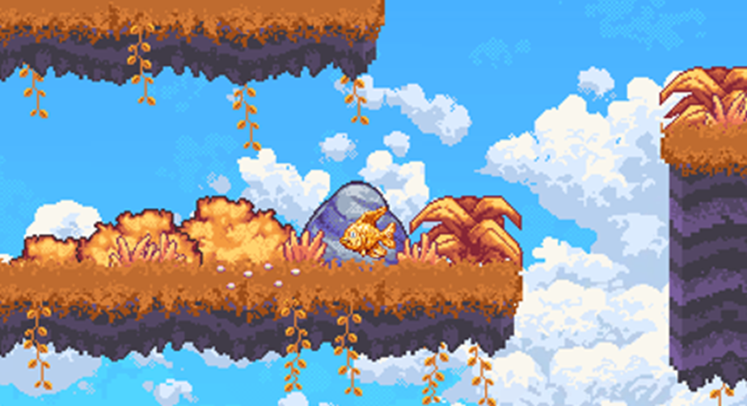

# Blubby the Goldfish

Blubby the Goldfish is an open-world exploration game where players control a goldfish swimming through a large, hand-crafted underwater map, discovering points of interest (a sunken ship, a cave, and more), meeting the characters found there, and completing side quests. See [`docs/GAME_DESIGN.md`](docs/GAME_DESIGN.md) for the full design doc.

**Current status:** pre-alpha, in transition. The project started from Godot's official 2D platformer demo and is being reworked toward the open-world exploration concept above. Core player movement (swimming, buoyancy) is in place, but the world/quest content, depth-pressure buoyancy rework, and non-player characters are still being built out.

Engine: Godot 4.7, GDScript only (no C#/.NET)

Renderer: Compatibility

Originally bootstrapped from Godot's official 2D platformer demo as starter code for movement/physics scaffolding: https://godotengine.org/asset-library/asset/120

## Features (carried over from the starter template, being reworked)

- Swimming controller using [`CharacterBody2D`](https://docs.godotengine.org/en/latest/classes/class_characterbody2d.html).
    - Can swim on and snap to slopes.
    - Can shoot, including while jumping.
- Enemies that crawl on the floor and change direction when they encounter an obstacle.
- Camera that stays within the level's bounds.
- Supports keyboard and gamepad controls.
- Platforms that can move in any direction.
- Gun that shoots bullets with rigid body (natural) physics.
- Collectible coins.
- Pause and pause menu.
- Pixel art visuals.
- Sound effects and music.

## Screenshots

## Music

[*Pompy*](https://soundcloud.com/madbr/pompy) by Hubert Lamontagne (madbr)
This will be changed to new music from our own composer.
