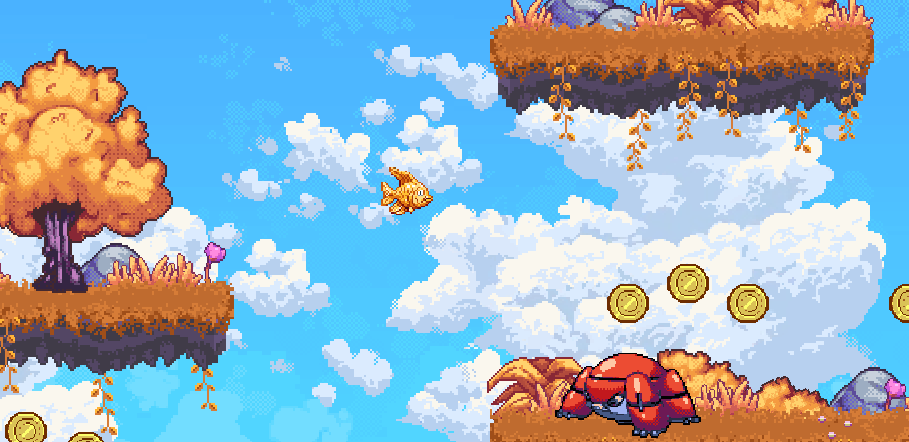

# 2D Platformer

This game, in pre-alpha, is a pixel art 2D side-scroller with graphics and sound.

This is a relatively complete pre-alpha, although a fish
that can jump, swim on slopes, fire bullets,
interact with enemies, and more, is sort of wacky.
In the future, blubby will be further fleshed out into a
character with swimming animations in a fish bowl. Stick
around to see our progress!

You will find most of the game's content in the `level.tscn` scene.
You can open it from the default `game.tscn` scene, or double
click on `level.tscn` in the `src/level/` directory.

Language: C#/GDScript

Renderer: Compatibility

Unapologetically copied the following as starter code!
Godot asset library: https://godotengine.org/asset-library/asset/120

## Features

- Side-scrolling blubby controller using [`CharacterBody2D`](https://docs.godotengine.org/en/latest/classes/class_characterbody2d.html).
    - Can swim on and snap to slopes.
    - Can shoot, including while jumping.
- Enemies that crawl on the floor and change direction when they encounter an obstacle.
- Camera that stays within the level’s bounds.
- Supports keyboard and gamepad controls.
- Platforms that can move in any direction.
- Gun that shoots bullets with rigid body (natural) physics.
- Collectible coins.
- Pause and pause menu.
- Pixel art visuals.
- Sound effects and music.

## Screenshots

## Music

[*Pompy*](https://soundcloud.com/madbr/pompy) by Hubert Lamontagne (madbr)
This will be changed to new music from our own composer.
